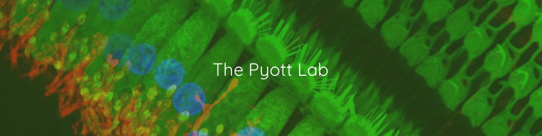

# ABR Peak Analysis




ABR Peak Analysis is a desktop tool for inspecting auditory brainstem response or VSEP recordings, filtering recordings, marking peaks/troughs, estimating thresholds, and exporting results.

This is a fork by The Pyott Lab of the EPL-maintained version of ABR Peak Analysis, originally written by Brad Buran.

## Installation

Download the latest version from the [Releases](https://github.com/TomNaber/abr-peak-analysis/releases) page.

Use the file appropriate for your platform:

- **Windows installer:** `ABR-Peak-Analysis-Setup-{version}-win-x64.exe`
- **Windows portable:** `ABR-Peak-Analysis-{version}-win-x64-portable.exe`
- **macOS Apple Silicon:** `ABR-Peak-Analysis-{version}-macos-arm64.pkg`

The regular Windows and macOS installers may require administrator permission.

The Windows portable version does not require installation or administrator permission. It can run directly and can check for updates, but it will only open the Releases page so you can download the newer portable executable yourself.

## Documentation

- [Help / user documentation](https://tomnaber.github.io/abr-peak-analysis/)
- [Changelog](CHANGELOG.md)

## Running from source

Create and activate the runtime environment:

```bash
conda create -n abr python=3.9.12 pip
conda activate abr
python -m pip install -r requirements.txt
```

Launch the application:

```bash
python Source/notebook.py
```

## Developer build tools

Install PyInstaller when building standalone application bundles:

```bash
python -m pip install pyinstaller
```

Build release artifacts into `Installers/`:

```bash
# macOS Apple Silicon
cd Source
./build_mac.sh

# Windows x64
cd Source
build_pc.bat
```

## License

See [LICENSE](LICENSE) for license details.
